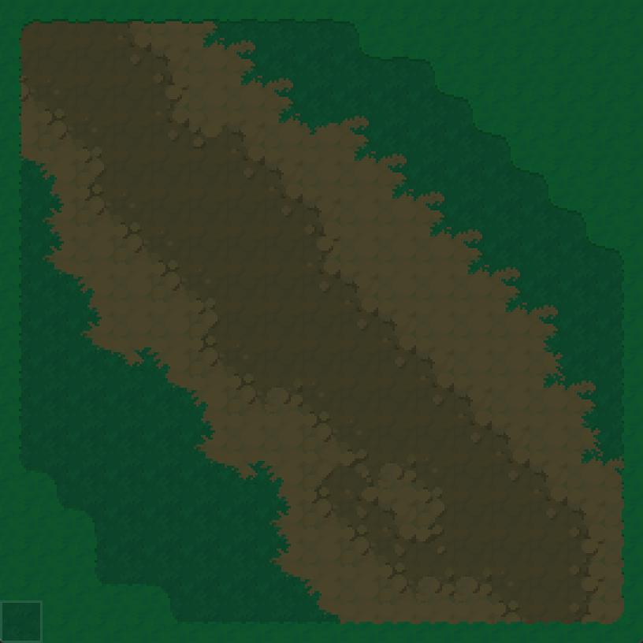

# EbitenDualGrid
Basic implementation of a dualgrid autotiling system in the Ebiten engine.

Ressources:
- [Basic Explanation](https://youtu.be/buKQjkad2I0?t=220)
- [Bitmask indexing](https://www.lexaloffle.com/bbs/?tid=143710)

## Example


```bash
cd .\example\
go run .
```