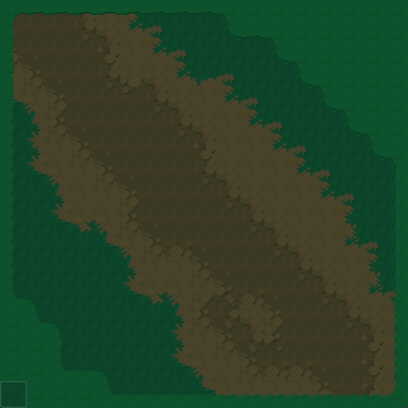

# EbitenDualGrid

Basic implementation of a dual-grid autotiling system for the [Ebiten](https://ebitengine.org/) game engine.

**Ebiten version:** Tested on v2.8+

Resources:
- [Basic Explanation](https://youtu.be/buKQjkad2I0?t=220)
- [Bitmask indexing](https://www.lexaloffle.com/bbs/?tid=143710)

## Example


```bash
# Editor with pan and zoom
go run ./example/editor/.

# Simple demo
go run ./example/simple/.
```

## Installation

```bash
go get github.com/davemane42/EbitenDualGrid
```

```go
import dualgrid "github.com/davemane42/EbitenDualGrid"
```

## Usage

**1. Load your images** (look into [./example/assets](./example/assets) for sprites)
```go
// 4x4 tilemap (64x64 for tileSize 16)
grassTilemapImage, _, err := ebitenutil.NewImageFromFile("grass.png")

// single tile (16x16)
rockTextureImage, _, err := ebitenutil.NewImageFromFile("rock.png")

// 4x4 mask (64x64 for tileSize 16)
rockMaskImage, _, err := ebitenutil.NewImageFromFile("mask.png")
```

> **Tilemap format:** [TODO: explain expected 4x4 tile arrangement and ordering]

> **Mask format:** [TODO: explain what a valid mask image looks like]

---

**2. Create the DualGrid**
```go
// NewDualGrid(width, height, tileSize int, defaultMaterial TileType)
dg := dualgrid.NewDualGrid(20, 15, 16, 0)
```

> `defaultMaterial` is the `TileType` used for corners that fall outside the grid bounds. It determines how edge tiles blend at the border of the world.

> `TileType` is a `uint8` index that identifies a material by its position in `dg.Materials`. When you call `AddMaterial`, materials are assigned indices starting at 0 in the order they are added.

---

**3. Create materials**

Materials with a higher index render on top of materials with a lower index. Plan your `AddMaterial` call order accordingly.

```go
// NewMaterialFromTilemap takes a 4x4 tilemap and builds a Material.
grassMat, err := dualgrid.NewMaterialFromTilemap(tileSize, grassTilemapImage, dualgrid.VarientMap{})

// NewMaterialFromMask takes a base texture and a 4x4 mask and builds a Material.
rockMat, err := dualgrid.NewMaterialFromMask(tileSize, rockTextureImage, rockMaskImage, dualgrid.VarientMap{})
```

> The `VarientMap` parameter lets you provide multiple visual variants for any bitmask index (0–15), adding visual diversity without manual tile placement. Variants are selected deterministically from world-space position so the same cell always shows the same variant.

```go
//bitmask is a 4bit number 0b0000 Top-Left, Top-Right, Bottom-Left and Bottom-Right
varientMap := dualgrid.VarientMap {
    3:  {17}, //bitmask index 3 0b0011 has an extra variant an material "slot" 17
    5:  {16}, //index 5  0b0101 -> slot 16
    10: {19}, //index 10 0b1010 -> slot 19
    12: {18}, //index 12 0b1100 -> slot 18
}
```

Pass `nil` to use no variants.

---

**4. Add materials**
```go
dg.AddMaterial(grassMat) // index 0 — rendered behind
dg.AddMaterial(rockMat)  // index 1 — rendered in front
```

---

**5. Paint cells by setting their material**

To update a cell and trigger a redraw:
```go
// SetCell mark the internal Canvas as dirty and get redrawn next time dg.Canvas() is called
dg.SetCell(x, y, dualgrid.TileType(materialIndex))
```

You can also write directly to the cell array:
```go
dg.WorldGrid.Cells[x][y] = dualgrid.TileType(materialIndex)
dg.MarkDirty()
```

Or with some grid helper functions
```go
// FillRect(x, y, w, h int, value TileType)
dg.WorldGrid.FillRect(2, 2, 16, 11, 1)

// OutlineRect(x, y, w, h int, value TileType)
dg.WorldGrid.OutlineRect(0, 0, 20, 15, 1)

dg.MarkDirty()
```

---

**6. Render to screen**

There are multiple ways to draw depending on your use case.

---

**Full canvas** — best for editors or static views.

The grid is rendered once and cached internally. Only redraws when a cell changes.

```go
// In your Draw() function:
opts := &ebiten.DrawImageOptions{}
// apply your camera transform here
screen.DrawImage(dg.Canvas(), opts)
```

For incremental updates (e.g. painting one tile at a time), use `RedrawCanvasRegion`
instead of marking the whole canvas dirty. It takes a tile position and size in **tile coordinates**:
```go
// RedrawCanvasRegion(tileX, tileY, tileW, tileH int)
dg.WorldGrid.Cells[tx][ty] = dualgrid.TileType(materialIndex)
dg.RedrawCanvasRegion(tx, ty, 1, 1)
```
The region is automatically expanded by one tile on each side to account for dual-grid overlap, so a 1×1 update redraws a 3×3 area of rendered tiles.

---

**Draw directly** — draw the grid to an existing image without using the internal canvas cache.

```go
// DrawTo(img *ebiten.Image, left, top int)
dg.DrawTo(img, x, y)
```

---

**Viewport canvas** — best for scrolling games with a camera and zoom.

Only the visible world region is rendered each frame into a reused internal canvas,
then drawn to screen with your camera transform applied.

```go
// In your Draw() function:

// Camera code is "Pseudo code"
// Compute the top-left corner of the viewport in world space.
// (Assumes camera position is centered on screen.)
viewLeft := int((cam.PosX - cam.ScreenWidth/2) / cam.Scale)
viewTop  := int((cam.PosY - cam.ScreenHeight/2) / cam.Scale)

// Add 2 extra tiles on each axis so the edges never show empty space
// when the viewport doesn't align perfectly to tile boundaries.
viewW := int(cam.ScreenWidth/cam.Scale)  + dg.TileSize*2
viewH := int(cam.ScreenHeight/cam.Scale) + dg.TileSize*2

// Shift the draw position back by half a tile to align the dual-grid's
// extra border row/column with the camera's world origin.
offset := float64(-dg.TileSize / 2)
var opts ebiten.DrawImageOptions
opts.GeoM.Translate(float64(viewLeft)+offset, float64(viewTop)+offset)
// apply your camera transform here

screen.DrawImage(dg.ViewCanvas(viewW, viewH, viewLeft, viewTop), &opts)
```

---

**Save / Load**
```go
// Serialize the grid state (TileSize, DefaultMaterial, material count, cell data)
data := dg.Marshal()
os.WriteFile("save.bin", data, 0644)

// Restore into an existing DualGrid (must have same TileSize, material count, and grid size)
data, _ := os.ReadFile("save.bin")
err := dg.Unmarshal(data, false)
// If DefaultMaterial differs it is overwritten with the saved value — no error.
// Returns an error if TileSize, material count, or grid dimensions mismatch.
```

Pass `true` as the second argument to allow loading a save file with a different grid size.
The WorldGrid and internal canvas are resized to match the saved dimensions:
```go
err := dg.Unmarshal(data, true)
```
